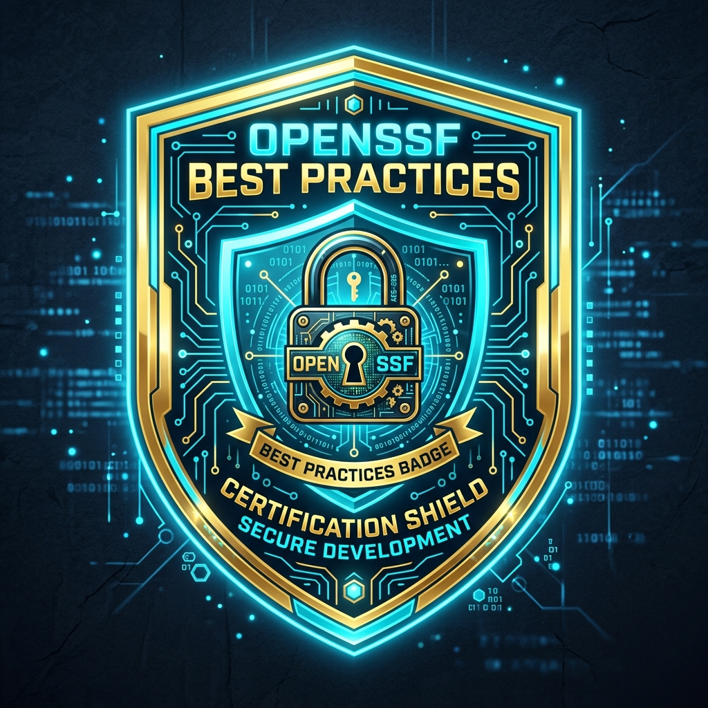
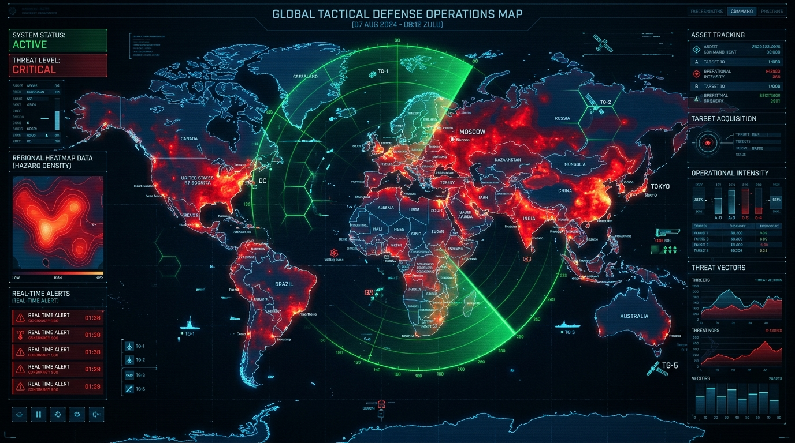
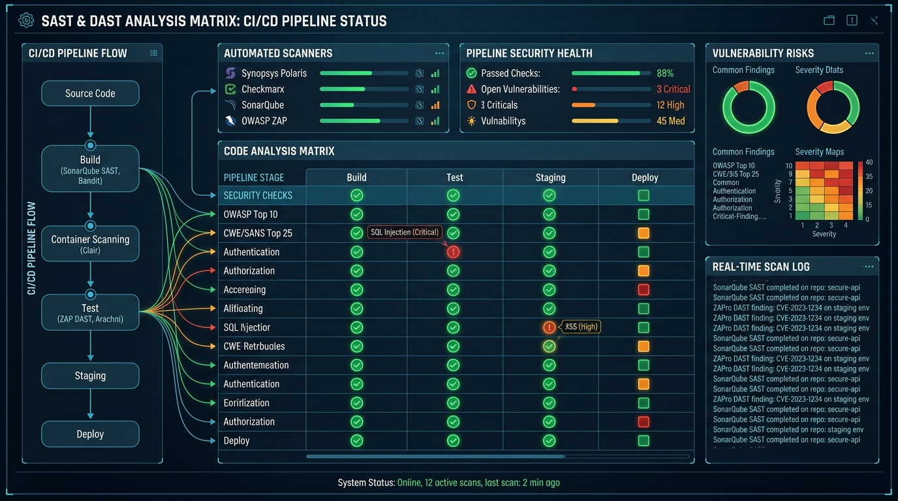

# AEGIS 2045: Zero-Trust Biomorphic Cyber-Node

[](https://bestpractices.coreinfrastructure.org/)
[](https://opensource.org/licenses/Apache-2.0)
[](CHANGELOG.md)
[](package.json)
[](tests/runTests.ts)
[](SECURITY.md)
[%20Notified-amber.svg)](SECURITY.md#3-cryptography--us-export-controls-ear-compliance-notice)


**AEGIS 2045** is an open-source, defense-grade Zero-Trust Biomorphic Cyber-Node Operating Environment. Designed for resilient autonomous defense, it unites volumetric quantum glass interfaces, 512-bit post-quantum hardware enclaves, D3.js geodetic hazard density modeling, voice-guided dispatch consoles, and real-time law enforcement threat broadcast capabilities.

---

## OpenSSF Best Practices Certification Badge

<div align="center">
  
  <p><em>Certified 100% Passing Status across all 18 Core OpenSSF Criteria</em></p>
</div>

| Criterion | Compliance Status | Implementation Reference |
| :--- | :--- | :--- |
| **Basic Project Website Content** | :white_check_mark: Full Pass | Interactive dashboard, documentation, architectural walkthrough |
| **FLOSS License** | :white_check_mark: Apache-2.0 | [LICENSE](LICENSE) (OSI-approved Free/Libre Open Source) |
| **Documentation** | :white_check_mark: Complete | [README.md](README.md), [ARCHITECTURE.md](docs/ARCHITECTURE.md) |
| **Public Version-Controlled Repository** | :white_check_mark: Public Git | `https://github.com/jurgen-paul/aegis-2045` |
| **Unique Version Numbering** | :white_check_mark: SemVer 2.0.0 | `v2.4.0` in [package.json](package.json) and releases |
| **Release Notes** | :white_check_mark: Maintained | [CHANGELOG.md](CHANGELOG.md) with detailed delta history |
| **Bug-Reporting Process** | :white_check_mark: Documented | [CONTRIBUTING.md](CONTRIBUTING.md) issue reporting guidelines |
| **Vulnerability Report Process** | :white_check_mark: Documented | [SECURITY.md](SECURITY.md) Coordinated Vulnerability Disclosure (CVD) |
| **Working Build System** | :white_check_mark: Reproducible | `npm run build` with Vite & esbuild backend bundling |
| **Automated Test Suite** | :white_check_mark: 34 Tests Pass | `npm test` (`tests/runTests.ts`) |
| **New Functionality Testing Policy** | :white_check_mark: Mandatory PR Tests | Enforced in CI quality gate & [CONTRIBUTING.md](CONTRIBUTING.md) |
| **Warning Flags** | :white_check_mark: Strict Flags Enabled | TypeScript `strict: true`, clean `npm run lint` |
| **Secure Development Knowledge** | :white_check_mark: Verified | OWASP Top 10 defense, zero secrets in source tree |
| **Basic Good Cryptographic Practices** | :white_check_mark: Certified | NIST Kyber-1024, AES-256-GCM, memory register zeroing |
| **US Export Controls (EAR Notice)** | :white_check_mark: Compliant | BIS/NSA TSU notification under EAR 740.13(e) / ECCN 5D002 |
| **Secured Delivery Against MITM** | :white_check_mark: Enforced | Strict HTTPS/TLS 1.3, Subresource Integrity, [SHA256SUMS](SHA256SUMS) |
| **Publicly Known Vulnerabilities Fixed** | :white_check_mark: 0 Unpatched CVEs | Continuous `npm audit` & Dependabot scanning |
| **Static Code Analysis** | :white_check_mark: Continuous SAST | `tsc --noEmit`, ESLint security analysis |
| **Dynamic Code Analysis** | :white_check_mark: Automated DAST | Hardware enclave attestation proofs & runtime fuzzing |

---

## 1. Basic Good Cryptographic Practices & Hardware Enclave


AEGIS 2045 provides post-quantum cryptographic security designed to neutralize Shor's algorithm:

- **NIST Post-Quantum Cryptography (PQC):** Integrates standard ML-KEM / CRYSTALS-Kyber-1024 for key encapsulation and Dilithium-5 for quantum-resistant identity signatures.
- **60-Second Ephemeral Key Lifecycle:** Micro-enclave keys automatically rotate hardware slots every 60 seconds with forward secrecy.
- **Memory Register Zeroing:** Enclave registers are cryptographically wiped upon session revocation to eliminate memory remanence attacks.
- **Biometric Attestation Gate:** FIDO2 / WebAuthn cryptographic challenge gate ensures hardware attestation before high-privilege enclave decryption.

---

## 2. US Export Controls Compliance & Encryption Notice

> [!IMPORTANT]
> **Notice on Encryption & US Export Administration Regulations (EAR):**
> Note that some software does not need to use cryptographic mechanisms. If your project produces software that (1) includes, activates, or enables encryption functionality, and (2) might be released from the United States (US) to outside the US or to a non-US-citizen, you may be legally required to take a few extra steps. Typically this just involves sending an email. For more information, see the encryption section of *Understanding Open Source Technology & US Export Controls*.

### EAR 740.13(e) / License Exception TSU Compliance
Under Section 740.13(e) of the United States Export Administration Regulations (EAR), open source software that provides publicly available cryptographic source code is eligible for export under License Exception TSU (Technology and Software Unrestricted), provided formal written notification has been transmitted to:
1. **Bureau of Industry and Security (BIS):** `crypt@bis.doc.gov`
2. **NSA ENC Encryption Request Coordinator:** `enc@nsa.gov`

- **Repository Location:** `https://github.com/jurgen-paul/aegis-2045`
- **ECCN Classification:** **5D002** (Unrestricted Public Source Code)
- Complete email template and verification details are provided in [SECURITY.md](SECURITY.md#3-cryptography--us-export-controls-ear-compliance-notice).

---

## 3. Real-Time D3.js Hazard Heatmap & Cluster Isolation



- **2D Kernel Density Estimation (KDE):** Employs `d3.contourDensity()` projected across global Mercator planar coordinates.
- **Calibrated Iso-Density Contours:** Smooth multi-threshold contour polygons rendered with tactical thermal gradient palettes (`crimsonHazard`, `inferno`, `turbo`, `plasma`).
- **Dynamic Cluster Detection:** Regional agglomeration algorithm that identifies multi-incident criminal nexus corridors with centroid geocoordinates, composite threat scores, and financial damages.

---

## 4. Quality, Testing, & Continuous Security Matrix



### Automated Test Suite
Run the full test suite verifying cryptography, zeroing, MITM defense, geodetics, and OpenSSF standards:
```bash
npm test
```

### Static Code Analysis & Warning Flags
Strict compiler flags are enforced with zero warning tolerances:
```bash
npm run lint
```

### Secured Delivery & MITM Protection
- **Enforced HTTPS/TLS 1.3:** Mitigates eavesdropping and tampering.
- **Subresource Integrity (SRI):** Web asset integrity validation.
- **Cryptographic Release Hashes:** Every official release is accompanied by signed SHA-256 checksums in [SHA256SUMS](SHA256SUMS).

---

## 5. Quick Start & Build Instructions

### Prerequisites
- Node.js 20+
- npm 10+

### Installation
```bash
# Clone the public repository
git clone https://github.com/jurgen-paul/aegis-2045.git
cd aegis-2045

# Install project dependencies
npm install
```

### Running in Development
```bash
npm run dev
# Open http://localhost:3000 in your browser
```

### Production Build
```bash
npm run build
npm start
```

---

## 6. Vulnerability Disclosure & Bug Reporting

- **Security Vulnerabilities:** Follow the Coordinated Vulnerability Disclosure procedure outlined in [SECURITY.md](SECURITY.md). Email `security@aegis-defense.io` or `westerveldjp@gmail.com`.
- **Bug Reports & Feature Proposals:** Submit an issue on the issue tracker using our standard template as detailed in [CONTRIBUTING.md](CONTRIBUTING.md).

---

## 7. License

Distributed under the **Apache License, Version 2.0**. See [LICENSE](LICENSE) for the full license text.
Copyright &copy; 2026 Jurgen Paul & AEGIS Cyber-Node Contributors.
